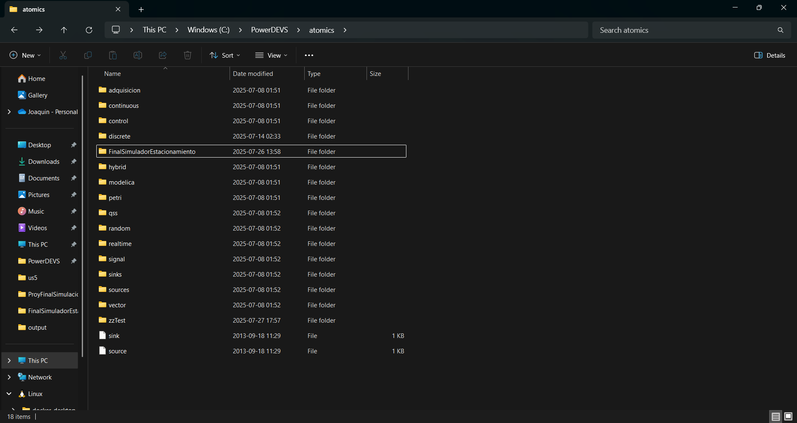
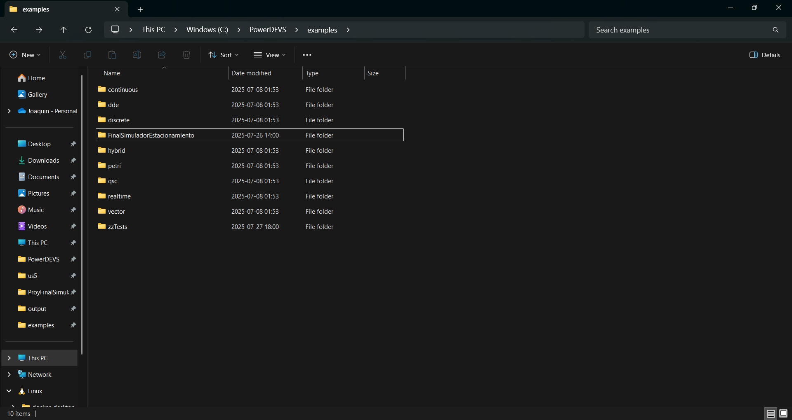

# 🚗 Simulación de Estacionamiento Inteligente con PowerDEVS

Este repositorio contiene un modelo completo de un sistema de estacionamiento inteligente modelado en PowerDEVS y documentado con Doxygen y LaTeX. Se incluye una guía de configuración, ejecución y personalización del sistema.

---

## 🧩 Componentes principales

El modelo está compuesto por distintos DEVS atómicos que simulan:
- Llegadas de vehículos aleatorias.
- Sensores de entrada y salida.
- Barreras de control automatizadas.
- Un controlador lógico.
- Un monitor que registra estadísticas del sistema.
- Un componente de salida gráfica usando GnuPlot.

---

## ⚙️ Modificación de parámetros

Podés modificar los **parámetros del sistema** directamente desde el archivo `estacionamiento_inteligente.pdm` o usando el editor gráfico de PowerDEVS. Algunos parámetros ajustables son:

- Capacidad máxima del estacionamiento.
- Tiempo de latencia para sensar un vehículo.
- Tiempos de apertura y cierre de barreras.
- Distribución de llegadas.
- Tiempos máximos de permanencia.

> ✏️ Estos valores pueden ser cambiados para experimentar con diferentes escenarios de tráfico o configuraciones del sistema.

---

## 🔩 Cómo preparar los archivos para la simulación

1. Abrí la carpeta donde está instalado PowerDEVS
2. Copiar la carpeta _**atomics**_ que se encuentra dentro de la carpeta **Codigo** de este .zip
3. Pegar la carpeta _**atomics**_ dentro de PowerDEVS y si pide reemplazar darle que sí (nuestro código tiene un nombre único de carpeta de los que vienen por defecto en PowerDEVS, por lo que no pisamos ningún archivo original).
4. Copiar la carpeta _**examples**_ que se encuentra dentro de la carpeta **Modelo** de este .zip
5. Pegar la carpeta _**examples**_ dentro de PowerDEVS y si pide reemplazar darle que sí (nuestro modelo tiene un nombre único de carpeta de los que vienen por defecto en PowerDEVS, por lo que no pisamos ningún archivo original).

Si todo salió bien, la carpeta **atomics** de PowerDEVS debe verse algo así:


Y la carpeta **examples** de PowerDEVS debe verse algo así:



## ▶️ Cómo ejecutar la simulación

1. **Abrí PowerDEVS.**
2. Seleccioná `Archivo > Abrir...` y cargá `estacionamiento_inteligente.pdm`.
3. Presioná el botón de **simulate** para compilar y ejecutar.
4. Los resultados estarán disponibles como gráficos y/o archivos `.csv`.

---

## 📄 Documentación Doxygen

Este repositorio incluye un archivo `Doxyfile` para generar la documentación técnica del código fuente en C++.

Es necesario instalarlo para que se pueda generar la documentación automáticamente.

#### Windows
Se puede descargar e instalar siguiendo la página oficial: http://www.doxygen.nl/download.html

#### Linux
Corriendo lo siguientes comandos via terminal se puede instalar Doxygen
```bash
sudo apt update
sudo apt install doxygen
```

### 🛠 Cómo generar la documentación:

```bash
doxygen Doxyfile
```

## 📚 Informe LaTeX en Overleaf

El informe técnico y formal del proyecto fue redactado en **Overleaf** utilizando formato **LaTeX**.

📝 **Link al proyecto**: [Abrir informe en Overleaf](https://www.overleaf.com/read/link)

Este informe incluye:
- Introducción teórica del modelo de estacionamiento.
- Descripción formal en notación **CML-DEVS**.
- Verificación de propiedades **safety** y **liveness**.
- Resultados experimentales con distintos parámetros.
- Análisis y discusión sobre las métricas de desempeño.

---

## 🧰 Instalación de PowerDEVS

### 🔧 En Linux
👉 [Link oficial para instalar PowerDEVS](https://git.exactas.uba.ar/sed/powerdevs-docker)

### 🔧 En Windows
👉 [PowerDEVS Windows - Sourcery Installer
](https://sourceforge.net/projects/powerdevs/)
