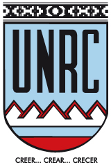
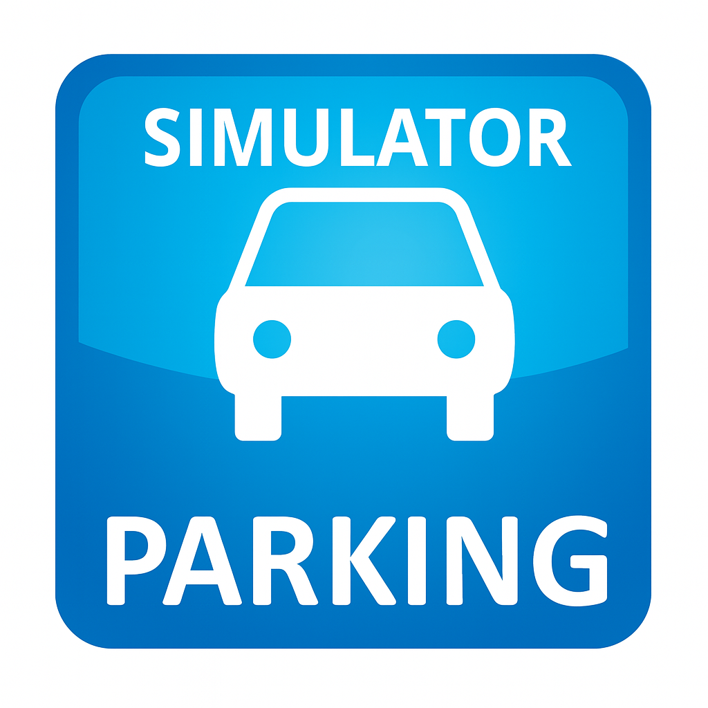

# Simulación de Estacionamiento

---

**Universidad Nacional de Río Cuarto**
Facultad de Ciencias Exactas, Físico-Químicas y Naturales
Proyecto de simulación basado en el formalismo DEVS.

---

## 🎯 Objetivo

Simular un sistema de estacionamiento inteligente con control de acceso, sensores, barreras automáticas y registro de estadísticas.

---

## 🧱 Componentes principales

| Módulo                                   | Descripción                                                  |
| ---------------------------------------- | ------------------------------------------------------------ |
| [controlador](controlador.cpp)           | Coordina el ingreso y egreso de vehículos.                   |
| [sensor_entrada](sensor_entrada.cpp)     | Detecta vehículos que quieren ingresar.                      |
| [sensor_salida](sensor_salida.cpp)       | Detecta vehículos que quieren salir.                         |
| [barrera_entrada](barrera_entrada.cpp)   | Abre y cierra según autorización.                            |
| [barrera_salida](barrera_salida.cpp)     | Controla el egreso.                                          |
| [estacionamiento](estacionamiento.cpp)   | Almacena vehículos hasta que salen.                          |
| [monitor](monitor.cpp)                   | Recolecta métricas: ocupación, promedio de permanencia, etc. |
| [gen_aleatorio](gen_aleatorio.cpp)       | Modela la llegada estocástica de vehículos.                  |
| [guardar_en_disco](guardar_en_disco.cpp) | Registra la información relevante en archivos CSV.           |

---

## 📊 Métricas observables

- Ocupación promedio
- Porcentaje de rechazos
- Tiempo promedio de permanencia

---

## 💡 Propiedades verificadas

- **Liveness**: todo vehículo que ingresa eventualmente puede salir.
- **Liveness**: tiempo que tarda en salir respecto del tiempo de permanencia en estacionamiento.
- **Safety**: no se permite ingreso si no hay lugar disponible.

---

© Nicolle Rosatti - Joaquin Tissera – "Simulación"
